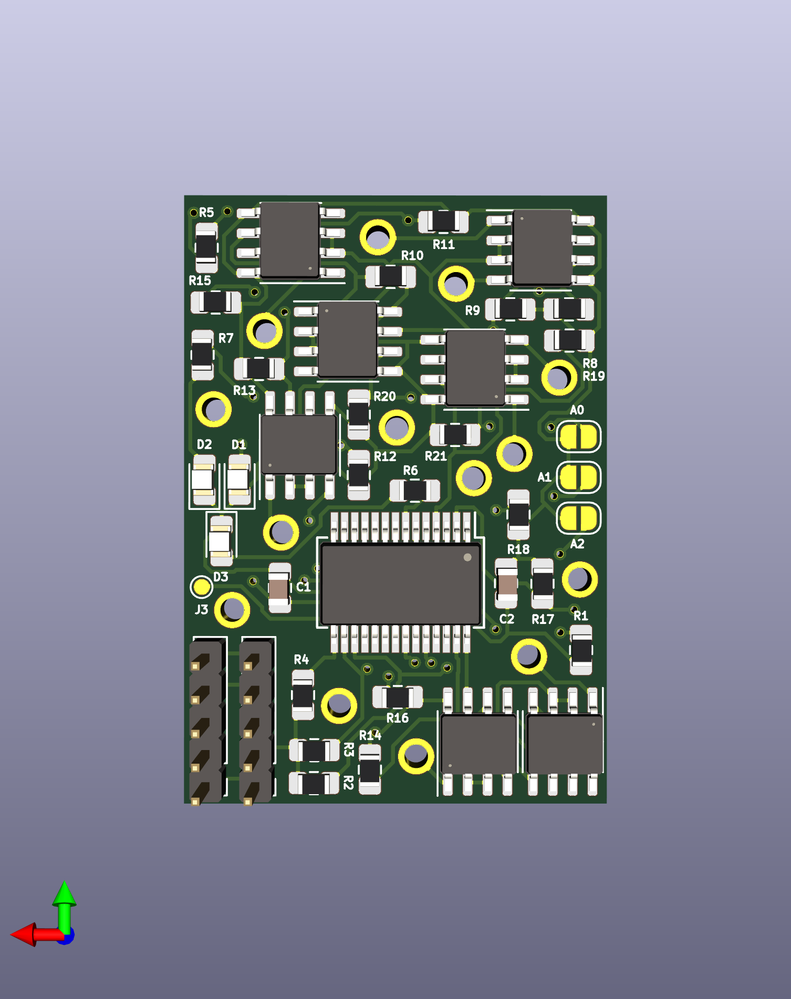
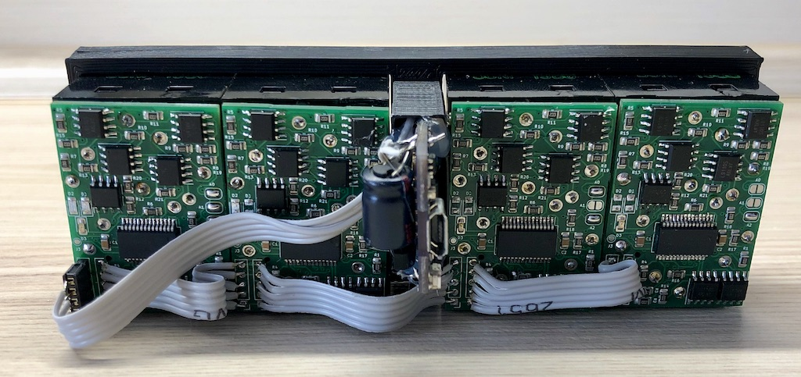

# EM7SEG
electro-mechanical 7 segment display (from dresser/wayne display)
 
_example: use 4 of that nice vintage modules as a clock_

**Teile**
| Ref | Wert | Package | JLCPCB Part |
|--------|--------|--------|--------|
| C1, C2 | 100n | 0805 | C49678 |
| R1-R4,R8-R21 | 10k | 0805 | C17414 |
| R5, R6 | 330 | 0805 | C17630 |
| R7 | 1k | 0805 | C17513 |
| D1, D2 | LED green | 0805 | C2297 |
| D3 | LED red | 0805 | C72038 |
| U2 | MCP23017-E/SS | SSOP | - |
| U3 - U9 | L9110S | TSSOP-8 | - |
| J1, J2 | Pin Header 5x | RM 2.0mm | - |

**Pin Header Zuordnung**
| Pin | Beschreibung |
|--------|--------|
| 1 | GND |
| 2 | Vcc Logik +3.3V / 5V|
| 3 | SDA |
| 4 | SCL |
| 5 | Vcc Segmentspulen 7.5-9V |

## UPDATE 05.03.2020
### Die Platinen sind angekommen 😍
#### ... und ich habe vergessen, einen Motortreiber (U3) bestücken zu lassen 😤 _(aber gut, das ist kein Problem, den MCP23017 muss ich ohnehin noch selbst auflöten)_

## UPDATE 10.04.2020
### Nach einem kleinen Redesign, sind am 09.04.2020 die Platinen V2.0 gekommen,
#### ...die einen Tag später "verarbeitet wurden"
#### Am schwierigsten war der MCP23017 (SSOP) aufzulöten. Von Hand! 

**Ein Mal angefangen, wurden gleich alle Platinen aufgebaut** 

**und mit den Displaymodulen "verheiratet"** 

## UPDATE 11.04.2020
# Die Uhr läuft!
 

